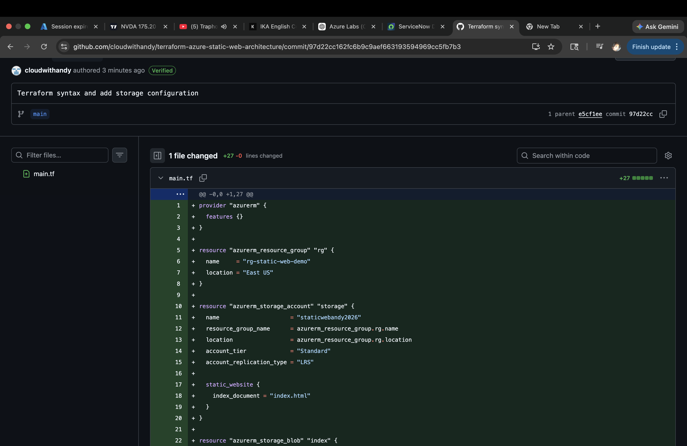
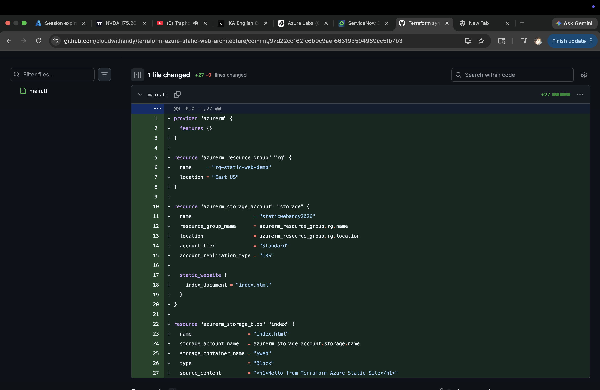
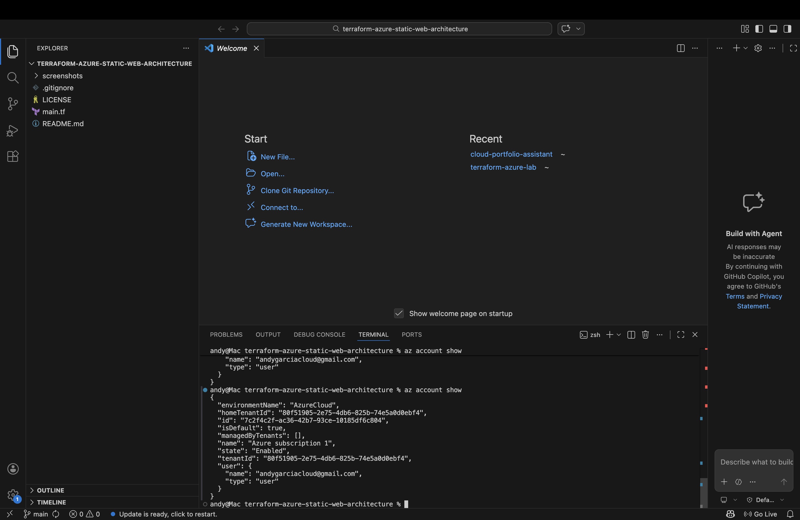
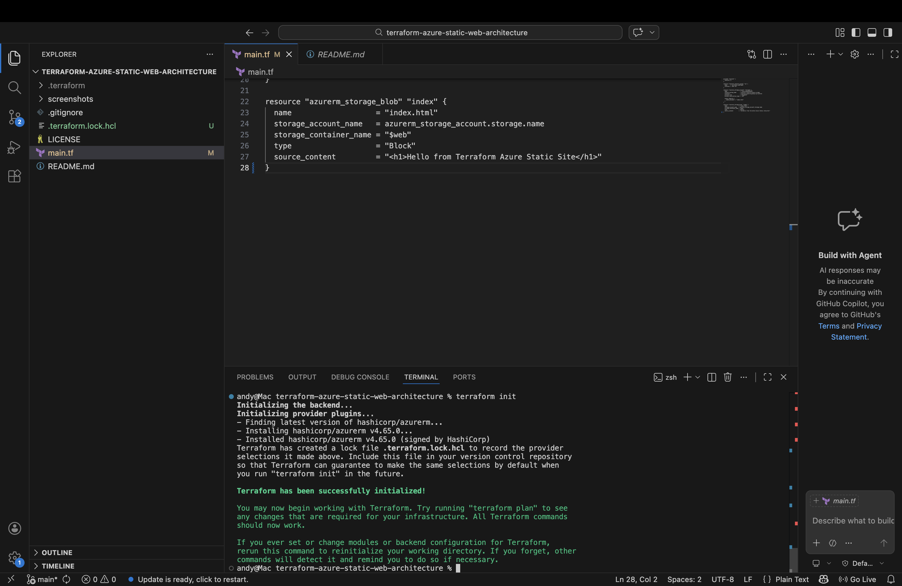
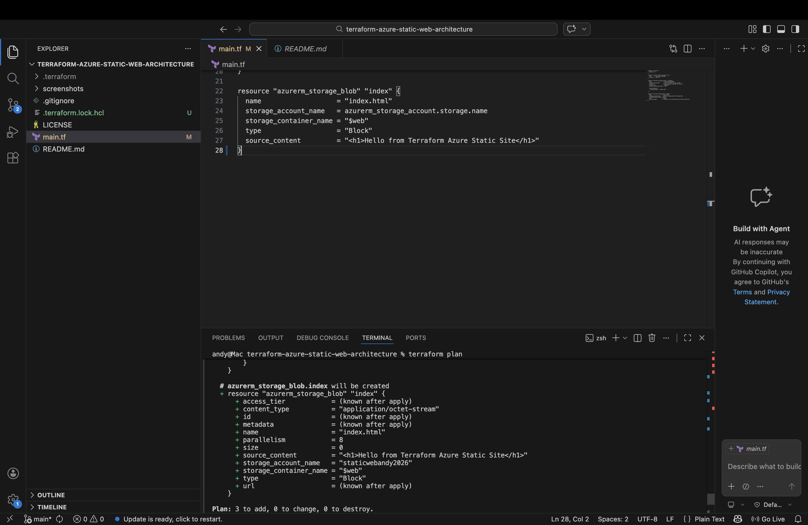
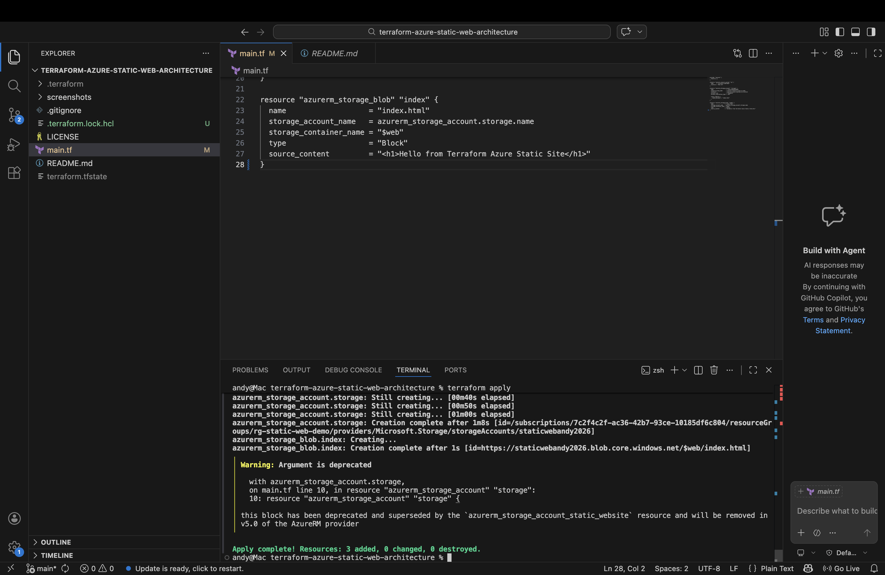
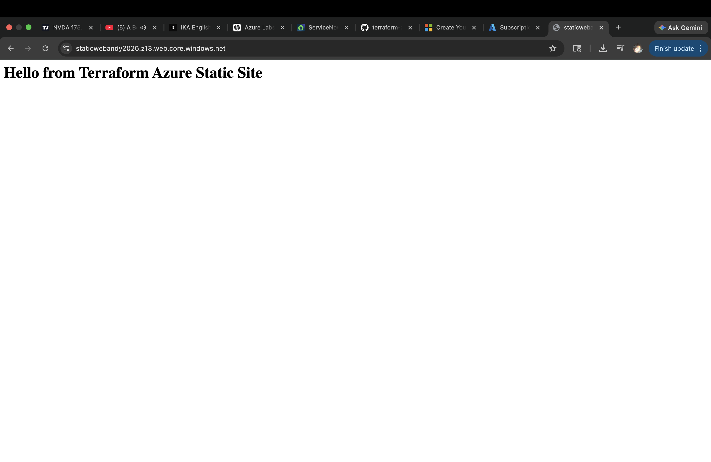

# terraform-azure-static-web-architecture
Terraform project deploying a production-style static website on azure storage with azure front door

## Overview

This project demonstrates how to use Terraform (Infrastructure as Code) to deploy a static website on Microsoft Azure.

The architecture includes:
- Azure Resource Group
- Azure Storage Account (Static Website Hosting)
- Blob Storage for website content
- Terraform for automated provisioning

This simulates a real-world cloud engineering workflow where infrastructure is deployed, versioned, and managed through code.

## Objective

The goal of this project is to:

- Build cloud infrastructure using Terraform
- Automate deployment of a static website
- Demonstrate GitHub version control practices
- Showcase a production-style cloud architecture

This project highlights core skills required for cloud and DevOps engineering roles.

## Tools and Technologies

- Terraform
- Microsoft Azure
- Azure Storage Accounts
- GitHub
- Infrastructure as Code (IaC)

## Project Progress

### 1. Repository Created

This step represents the initialization of the project repository on GitHub.
The repository serves as the central location for managing Infrastructure as Code (IaC) using Terraform.

At this stage:
- A new repository was created to host the project
- Version control was established to track changes
- The project structure was prepared for Terraform configuration files

This is a critical first step in any cloud engineering workflow, ensuring proper source control and collaboration capability.

### 2. Terraform Initial Commit

This screenshot captures the first commit of the Terraform configuration.

The commit includes:
- Azure provider configuration (azurerm)
- Creation of a resource group
- Definition of a storage account

The commit message reflects a structured workflow, demonstrating how infrastructure changes are tracked incrementally using Git.

This mirrors real-world DevOps practices where every infrastructure change is versioned and documented.

### 3. Terraform Code Breakdown

This section highlights the Terraform configuration used to deploy the infrastructure.

Key components defined:

- Azure Resource Group  
  A logical container that holds all related Azure resources

- Azure Storage Account  
  Used to host static website files

- Static Website Configuration  
  Enables hosting directly from Azure Storage

- Blob Resource (index.html)  
  Uploads a simple HTML file to serve as the website

This demonstrates how Infrastructure as Code allows repeatable, automated deployments of cloud resources.

## What This Project Demonstrates

This project showcases:

- Infrastructure provisioning using Terraform
- Azure cloud architecture fundamentals
- Static website hosting in Azure
- Version control using GitHub
- Documentation and project structuring best practices

## Next Steps

The next phase of this project includes:

- Running Terraform (init, plan, apply)
- Deploying resources into Azure
- Verifying storage account and static website configuration
- Accessing the live hosted website

Additional screenshots and validation steps will be added to demonstrate a full deployment lifecycle.

## Key Takeaway

This project demonstrates the ability to design, deploy, and document cloud infrastructure using modern DevOps practices.

It reflects real-world engineering workflows where infrastructure is:
- Automated
- Version-controlled
- Reproducible

### 4. Azure Subscription Active

This step confirms that an active Azure subscription was available and selected before deployment. Terraform requires a valid subscription in order to provision resources successfully.

This step demonstrates:
- Azure account verification
- Subscription selection for deployment
- Proper CLI environment preparation

### 5. Terraform Init

Terraform was initialized in the project directory to download the required Azure provider and prepare the working directory for infrastructure deployment.

This step demonstrates:
- Terraform initialization
- Provider installation
- Working directory preparation for Infrastructure as Code

### 6. Terraform Plan

Terraform plan was used to preview the infrastructure changes before deployment. This validated the configuration and showed exactly which resources would be created.

This step demonstrates:
- Safe infrastructure previewing
- Validation before deployment
- Understanding of the Terraform workflow

### 7. Terraform Apply

Terraform apply created the Azure resources defined in the configuration. This included the resource group, storage account, and static website content.

This step demonstrates:
- Real Azure infrastructure deployment
- Execution of Terraform in a live environment
- Automated resource provisioning through code

### 8. Live Website

After deployment, the static website endpoint was opened in the browser and successfully displayed the hosted HTML page.

This confirmed that:
- The Azure resources were deployed correctly
- Static website hosting was functioning properly
- The uploaded site content was publicly accessible

